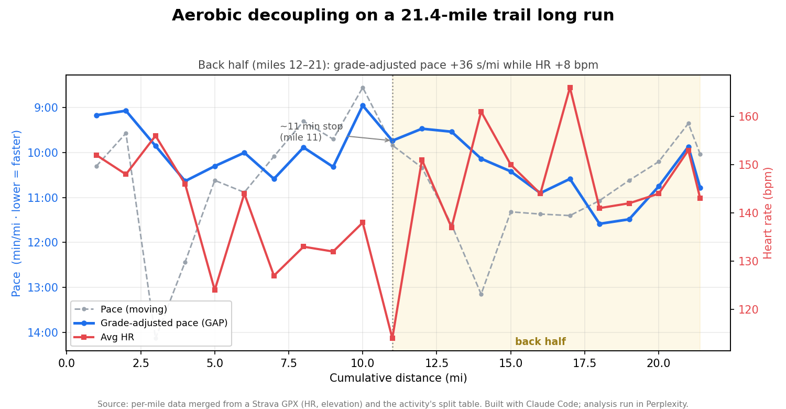

# Long-run decoupling — a Perplexity "Builder" exercise

> *Powering curiosity, literally.* I took a question I actually care about — **what makes ultra-endurance running possible, and where do I personally fall apart?** — and used Perplexity to learn the science, analyze my own run data, and sketch the product I'd build next.

**▶ Live Perplexity thread:** https://www.perplexity.ai/search/9703b24d-5fd3-4298-98e5-65b06bbe50c1

This repo is the *making-of* that thread: the data, the prompts, and the one real finding it surfaced. It's my submission for **Option 1** ("teach us about your favorite topic") of Perplexity's pre-interview product exercise.



---

## The topic: ultra-endurance / human performance

It's a genuine passion — I run ultras and build tools for the sport — *and* it's the industry I'd most want to innovate inside. Endurance training still runs largely on coaches' intuition and scattered data: exactly the kind of domain where an agentic product that "transforms knowledge into action" could change how people train, fuel, and race.

## What went into Option 1

The thread deliberately walks Perplexity's own **Learn → Build → Integrate → Repeat** cycle:

| Phase | Query | What it does |
|---|---|---|
| **Learn** | 1–2 | Teach the topic; go deep on fueling science |
| **Build** | 3 | Analyze *my own* 21.4-mile trail run (the data work below) |
| **Integrate** | 4–5 | Turn the finding into a product thesis; tie back to mission |

### The prompts

**1 — teach:**
```
Teach a curious, smart audience what makes 200+ mile ultramarathons like the Cocodona 250 humanly possible. Give a vivid but rigorous walkthrough of what happens to the body and mind over 2-4 days of near-continuous movement: energy systems and glycogen depletion, sleep deprivation and hallucinations, GI distress and why fueling (not the legs) is the #1 cause of DNFs, and what actually separates finishers from those who drop. Cite primary sources where you can.
```
**2 — go deeper on fueling:**
```
Now zoom in on the part most people get wrong: fueling. What does current sports-science actually say about carbohydrate intake rate (g/hr), the multiple-transportable-carbohydrate approach, sodium/hydration, and "gut training"? Where does the evidence genuinely disagree, and what's still an open question worth researching?
```
**3 — analyze my run (data attached / pasted):**
```
Attached is per-mile data from a 21.4-mile trail long run. Column key: pace_min_mi = moving pace; gap_min_mi = grade-adjusted pace; gpx_split_time_sec = ELAPSED time incl. stops (a large value means I stopped); avg/max_hr_bpm and elevation gain/loss are from the GPX. Compare the back half (miles 12-21) to the first half: is there aerobic decoupling — heart rate rising while grade-adjusted pace slows? Quantify it. Using GAP (which removes terrain), how much of my back-half slowdown is genuine fatigue vs hills? Call out mile 11 (note the elapsed-time spike). Show a chart of pace, GAP, and HR over distance, and give me the two highest-leverage things to work on.
```
**4 — the product thesis:**
```
Based on the decoupling/fade pattern you just found in my data: if you were building a Perplexity "Computer"-style agent to coach endurance athletes, design the v1 that would catch and counter that exact failure mode in real time — ingesting wearable + course + weather data and TAKING ACTIONS (adjusting pacing, prompting fuel/hydration, alerting the crew). Note I don't even log fueling today: how would the product capture the hardest-to-get data without adding friction mid-run? What's the smallest version that creates a real data flywheel, and what would you deliberately NOT build first?
```
**5 — tie to mission:**
```
Last one: using my own run as the example, make the case for why endurance sport is a great proving ground for agentic AI that "transforms knowledge into action," and why "powering curiosity" is the right mission for turning training from intuition-plus-scattered-data into a personalized system.
```

### The data work (built with Claude Code)

- **Source:** a Strava GPX (14,789 per-second points — GPS, elevation, heart rate) + two split-table screenshots from the same activity.
- **Pipeline:** parsed the GPX, computed per-mile elevation gain/loss and avg/max HR (haversine distance → mile buckets), and merged it with the screenshot splits (authoritative pace & grade-adjusted pace) into one tidy 22-row CSV.
- **Cross-check:** GPX-derived elevation tracks Strava's own split figures (mile 3: +458 ft screenshot vs +422 net GPX; mile 19: −359 vs −365) — so the merge is validated, not hand-waved.

### The finding

Clean **aerobic decoupling** in the back half — more effort for less effort-adjusted speed:

- **Grade-adjusted pace slowed +36 s/mi** (9:52 → 10:28) — terrain removed, so it's real fatigue, not hills.
- **Average HR rose +8 bpm** (140 → 149) over the same stretch.
- **Mile 11** hides an ~11-minute stop (20.8 min elapsed vs 9:50 *moving* pace; HR dipped to 114) — the kind of thing that quietly distorts a naïve "pace per mile" read.

## The data

| file | what it is |
|---|---|
| [`data/long-run-splits.csv`](data/long-run-splits.csv) | The merged per-mile dataset (the file used in the thread). |
| [`data/decoupling-chart.png`](data/decoupling-chart.png) | Pace, grade-adjusted pace, and HR over distance. |
| `data/strava-splits-miles-01-12.png`, `…-11-21.png` | The original split-table screenshots (source evidence). |

**CSV columns:** `mile`, `split_dist_mi`, `pace_min_mi` / `pace_sec` (moving pace), `gap_min_mi` / `gap_sec` (grade-adjusted pace), `strava_elev_change_ft` (from splits), `gpx_elev_gain_ft` / `gpx_elev_loss_ft` (from GPX), `avg_hr_bpm` / `max_hr_bpm`, `gpx_split_time_sec` (elapsed, includes stops), `cum_dist_mi`, `cum_time_min`.

**Withheld for privacy:** the **raw GPX is intentionally not included** — it contains exact start-of-run GPS coordinates. Only de-identified per-mile aggregates (no lat/lon) are published here.

## Limitations / honest notes

- **Free (non-paid) Perplexity tier.** No Research mode and no model selection were used — just the default model + standard search. A Pro account would have enabled deeper multi-step research and model comparison.
- **CSV upload is a Pro feature** (as is chart rendering). Workaround used on the free tier: the CSV is only 22 rows, so it can be **pasted as plain text** straight into the query and analyzed inline. (The chart in this repo was generated locally, not by Perplexity.)
- **No fueling data.** These sources capture pace, HR, and elevation but not nutrition — so the analysis is about effort and terrain, not carbs. Adding a `carbs_g` column would let nutrition into the model.
- **n = 1.** One run. The decoupling here is real for this effort, not a population-level claim.
- **Consumer-GPS metrics.** GPS-derived distance/elevation differ slightly from barometric/wheel-measured truth; treat a few-percent wobble as noise.

## Multiple AI tools (transparency)

This was deliberately a multi-tool build, and that's part of the point:

- **Perplexity** ran the actual thread — taught the topic, analyzed the pasted data, and generated the product thesis. *(The deliverable.)*
- **Claude Code** built the GPX→CSV pipeline, designed and iterated the prompts, found and charted the decoupling, and assembled this repo.

Going raw-data → insight → product thesis by orchestrating more than one AI tool is exactly the kind of "builder" workflow the exercise is meant to surface.

---

*Jason J. Garcia · [GitHub](https://github.com/jasonjgarcia24) · [LinkedIn](https://www.linkedin.com/in/24-jason-j-garcia/) · built for Perplexity's Product Manager (Builder) exercise, June 2026.*
